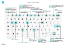

# Flýtivísanir lyklaborðs - Aðeins fyrir PC-tölvurKeyboard Quick Reference - PC Only

#### AlmenntGeneral

|Ýttu á þessa takkaPress these keys|Til að gera þettaTo do this|  
|-|-|
|Alt+F2Alt+F2|Sýna og fela FactBox-yfirlitiðShow and hide the FactBox pane|
|Alt+NAlt+N|Stofna nýja færsluCreate a new record|
|Alt+Shift+NAlt+Shift+N|Lokið nýstofnaðri færslu og Stofnið nýjaClose a newly created record and create a new one|
|Alt+OAlt+O|Bæta við nýrri athugasemd fyrir völdu færslunaAdd a new note for the selected record|
|Alt+QAlt+Q|Opna **Segðu mér**Open **Tell me**|
|Alt+UppAlt+Up|Opna ábendingu eða staðfestingarvilluOpen tooltip or validation error|
|Alt+NiðurörAlt+Down Arrow|Opna fellilista eða flettu uppOpen a drop-down or look up|
|Alt+TAlt+T|Opna síðuna **Mínar stillingar**Open the **My Settings** page|
|Alt+Shift+NAlt+Shift+W|Opna núverandi spjald eða skjal í nýjum gluggaOpen the current card or document in a new window|
|Ctrl+InsertCtrl+Insert|Setja inn nýja línu í skjaliInsert a new line on a document|
|Ctrl-DeleteCtrl-Delete|Eyða línunni í fylgiskjali, færslubók eða vinnublaðiDelete the line on a document, journal, or worksheet|
|Ctrl+Shift+F12Ctrl+Shift+F12|Línuatriðahluti hámarkaður á skjalssíðuMaximize the line items part on a document page|
|Ctrl+F1Ctrl+F1|Opna hjálp fyrir síðunaOpen help for the page Fletta upp þegar sérstilla á og sérsníðaNavigate when personalizing and customizing|
|Ctrl+SmellaCtrl+Click|Fletta upp þegar sérstilla á og sérsníðaNavigate when personalizing and customizing|
|Shift+F12Shift+F12|Opnaðu hlutverkaleit sem er yfirlit yfir eiginleika.Open the role explorer, a feature overview|
|F5/Ctrl+F5F5/Ctrl+F5|Endurnýja/endurhlaða síðanRefresh/reload page|
|Tab/Shift+TabTab/Shift+Tab|Færa áherslu á næstu/fyrri eininguMove focus to the next/previous element|
|F6/Shift+F6F6/Shift+F6|Fara yfir í næsta flýtiflipa/hlutaMove to next FastTab/part|

#### Skoða og velja línurNavigate & Select Rows

|Ýttu á þessa takkaPress these keys|Til að gera þettaTo do this|
|-|-|
|Heim/LokaHome/End|Fara í fyrsta/síðasta reitinnGo to first/last field|
|Ctrl+Heim/LokaCtrl+Home/End |Fara í fyrstu/síðustu röðGo to first/last row|
|Ctrl+Upp/NiðurCtrl+Up/Down|Skoða án þess að tapa valiNavigate without losing selection|
|Ctrl+ACtrl+A |Velja alltSelect all|
|Ctrl+bilCtrl+Space|Víxla raðavaliToggle row selection|
|Ctrl/Shift+SmelltuCtrl/Shift+Click|Bæta röðinni/röðunum við valiðAdd the row/rows to the selection|
|Shift+Upp/NiðurShift+Up/Down|Bæta við röðum fyrir ofan/neðan við valAdd row above/below to selection|
|Shift+síða upp/niðurShift+Page Up/Down|Velja sýnilegar raðir fyrir ofan/neðanSelect visible rows above/below|
|Ctrl+EnterCtrl+Enter|Setja áherslu utan listansFocus out of the list|

#### Afrita og límaCopy & Paste

|Ýttu á þessa takkaPress these keys|Til að gera þettaTo do this|
|-|-|
|Ctrl+C/VCtrl+C/V|Afrita/líma raðirCopy/paste rows|
|F8F8|Afrita reit hér að ofan í núverandi röðCopy field above into current row|

#### Leita, afmarka og raðaSearch, Filter, & Sort

|Ýttu á þessa takkaPress these keys|Til að gera þettaTo do this|
|-|-|
|Alt+F7Alt+F7|Raða dálkum í hækkandi/lækkandi röðSort column in ascending/descending order|
|F3F3|Víxla leitToggle search|
|Shift+F3Shift+F3|Víxla síusvæði; setja áherslu á svæðasíurToggle filter pane; focus on field filters|
|Alt+F3Alt+F3|Síur á völdum hólfgildumFilter on selected cell value|
|Shift+Alt+F3Shift+Alt+F3|Bættu við síu á völdum reitAdd filter on selected field|
|Ctrl+Alt+Shift+F3Ctrl+Alt+Shift+F3|Endurstilla afmarkanirReset filters|

#### Snögg færslaQuick Entry

|Ýttu á þessa takkaPress these keys|Til að gera þettaTo do this|
|-|-|
|Ctrl+Shift+EnterCtrl+Shift+Enter|Fara í næsta reit flýtifærslu utan listaGo to next Quick Entry field outside a list|
|Enter/Shift+EnterEnter/Shift+Enter|Fara í næsta/fyrri reit flýtifærsluGo to next/previous Quick Entry field|
##### Forskoðun skýrsluReport Preview

|Ýttu á þessa takkaPress these keys|Til að gera þettaTo do this|
|-|-|
|Ctrl+Heim/LokaCtrl+Home/End|Fara á fyrstu/síðustu síðuGo to the first/last page|

> [!TIP]
> Fyrir myndræna, prentvæna útgáfu velurðu eftirfarandi mynd og sækir PDF-skjalið.For a graphical, print-friendly version, choose the following image and download the PDF file.
>
> 

[!INCLUDE[footer-include](includes/footer-banner.md)]