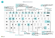

# Flýtivísanir

Þessi grein inniheldur yfirlit yfir nokkrar af samsetningum flýtilykla sem þú getur notað þegar þú ert að vinna með [!INCLUDE[prod_short](includes/prod_short.md)].

Yfirlit yfir vinsælustu flýtivísanirnar má fá [í flýtivísanir lyklaborðs (aðeins PC)](keyboard-shortcuts-cheatsheet.md).

> [!TIP]
> Til að fá yfirlit yfir mest notuðu flýtileiðirnar skaltu velja eftirfarandi mynd og sækja PDF-skjalið.  
> 

## Yfirlit

Flýtivísanir aðstoða við aðgengi og geta auðveldað flettingar og gert þær skilvirkari yfir á önnur svæði og aðrar einingar á síðu. Flestir vafrar styðja þessar flýtivísanir en hegðunin getur þó verið breytileg.

> [!NOTE]
> Flýtivísanir sem hér er lýst vísa til bandarísks lyklaborðs. Uppsetning lyklanna á öðrum lyklaborðum getur ekki samræmst nákvæmlega lyklunum á bandarönskum lyklaborðum.

Flestar flýtileiðirnar eru þær sömu hvort sem stýrikerfið er Windows eða macOS. Hins vegar eru nokkrar flýtileiðir frábrugðnar fyrir macOS. Þessar flýtileiðir eru tilgreindar með sviga í eftirfarandi hlutum.

> [!NOTE]
> Business Central styður aðeins eitt stafamengi fyrir gögn. Þess vegna geta sumir stafir ekki verið studdir í umhverfinu og vandamál komi upp þegar sótt eru gögn sem færð voru inn með öðru stafamengi. Þetta getur einnig átt við um flýtivísanir. Til dæmis getur verið að umhverfi þitt styðji aðeins enska og rússneska stafi. Ef gögn eru færð inn á öðru tungumáli verða þau hugsanlega ekki vistuð rétt. Hafa skal samband við kerfisstjórann til að ganga úr skugga um að skilja hvaða tungumál eru studd af Business Central. 

> [!NOTE]
> Auk altækra flýtilykla sem lýst er í þessari grein er hægt að nálgast fjölda sértækra flýtilykla. Í almennri útgáfu af [!INCLUDE[prod_short](includes/prod_short.md)] F9 <kbd></kbd>  bókar t.d. skjal og <kbd>Ctrl</kbd>+<kbd>F7</kbd> sýnir færslur færslu þegar færslan er opnuð á spjaldi. Í þessari grein eru nokkrar af algengari viðskiptatengdum flýtileiðum sem sýndar eru með skáletri. Hafðu í huga að raunverulegar flýtileiðir geta verið öðruvísi í lausninni þinni. Í notandaviðmótinu er flýtilykillinn sýndur í ábendingunni fyrir viðkomandi aðgerð.

##   Flýtivísanir almennt

Eftirfarandi tafla lýsir flýtivísunum til að fletta og komast í mismunandi einingar á síðu. Einingar eru hluti eins og aðgerðir, fellilistar, leit og fleira. Nánari upplýsingar um flýtivísanir til að fletta færslum þegar notandi er inni á lista eru í næsta hluta.

|Þessir lyklar eru valdir (í macOS)|Til að gera þetta|
|--------------------------------|----------|
|<kbd>Alt</kbd>|Sýna aðgangslykla til að velja aðgerðir á aðgerðaslánni og yfirlitsvalmyndinni á síðunni. Nánari upplýsingar eru í [Aðgangslyklar.](#access-keys-for-action-bar-and-navigation-menu)|
|<kbd>Alt</kbd>+<kbd>niður ör</kbd>|Opna fellilistann eða skoða gildi fyrir reit.|
|<kbd>Ctrl</kbd>+<kbd>valkostur</kbd>+<kbd>niðurör</kbd>|Opna spjald tengdra færslna eða listasíðu afmarkaða við gildið í uppflettingar- eða aðstoðarbreytingareitnum.|
|<kbd>Alt</kbd>+<kbd>upp ör</kbd>|Sýna ábendingu fyrir reit eða dálkahaus í töflu. Ef svæðið er með villuleitarvillur er Alt <kbd>upp ör</kbd>+<kbd>valin</kbd> til að sýna villuleitina. Esc eða Alt <kbd>Up Arrow</kbd> er valið <kbd>til að loka ábendingunni.</kbd>+<kbd></kbd> |
|<kbd>F2</kbd>|Víxla á milli þess að velja gildi reitsins í heild sinni eða setja bendilinn við lok reitargildis.|
|<kbd>Alt</kbd>+<kbd>F2</kbd>|Sýna og fela FactBox-yfirlitið.|
|<kbd>Alt</kbd>+<kbd>vakt</kbd>+<kbd>F2</kbd>|<kbd>Vakt</kbd> á milli **Sundurliðunar**  **og** Viðhengja á upplýsingakassasvæðinu.|
|<kbd>Alt</kbd>+<kbd>O</kbd>|Bættu nýrri athugasemd við völdu færsluna, jafnvel þótt upplýsingakassinn sé ekki opinn.|
|<kbd>Alt</kbd>+<kbd>Q</kbd>  (<kbd>Ctrl</kbd>+<kbd>valkostur</kbd>+<kbd>Q</kbd>)|Opnaðu gluggann **Viðmótsleið**. Nánari upplýsingar [eru í Finna síður og upplýsingar með Tell Me](ui-search.md).|
|<kbd>Ctrl</kbd>+<kbd>Alt</kbd>+<kbd>Q</kbd>  (<kbd>Ctrl</kbd>+<kbd>Valkostur</kbd>+<kbd>Cmd</kbd>+<kbd>Q</kbd>)|Opnaðu síðuna **Finna færslur** til að finna skjöl og færslur sem tengjast hver annarri út frá algengum upplýsingum, eins og skjalanúmeri eða bókunardagsetningu. Nánari upplýsingar [eru í Finna tengdar heildir fyrir bókuð skjöl](ui-find-entries.md)|
|<kbd>Alt</kbd>+<kbd>N</kbd> |Opna síðu til að búa til nýja færslu. (Svipað og að velja aðgerðirnar **Nýtt** og **+**.)|
|<kbd>Alt</kbd>+<kbd>Vakt</kbd>+<kbd>N</kbd> |Velja nýlega stofnaða síðu og opna nýja til að búa til nýja færslu. Alt <kbd>F9</kbd>+<kbd>bókar skjal á sama hátt</kbd>  og stofnar nýtt.|
|<kbd>Alt</kbd>+<kbd>T</kbd>|Opna síðuna **Mínar stillingar**.|
|<kbd>Alt</kbd>+<kbd>hægri ör</kbd>|Fletta upp viðbótarupplýsingum eða undirliggjandi gildum fyrir reit sem inniheldur . hnappur. Notað þegar venjulegur fellilistahnappur (<kbd>Alt</kbd>+<kbd>Down Arrow</kbd>) í sama reit er notaður í öðrum tilgangi.|
|<kbd>Ctrl</kbd>+<kbd>Alt</kbd>+<kbd>vakt</kbd>+<kbd>C</kbd>|Birta upplýsingar í merki fyrirtækis. Frá og með Business Central 2022 útgáfubylgju 2 (útgáfa 21) er þessi flýtivísun ekki lengur studd og í stað <kbd>Ctrl</kbd>+<kbd>O</kbd>. |
|<kbd>Ctrl</kbd>+<kbd>Alt</kbd>+<kbd>F1</kbd>|Opna og loka glugganum fyrir síðueftirlit. Glugginn fyrir síðueftirlit sýnir upplýsingar um síðuna, t.d. upprunatöflu, reiti, síur, viðbætur og fleira.  Nánari upplýsingar [eru í Skoðun síðna](across-inspect-page.md).|
|<kbd>Ctrl</kbd>+<kbd>C</kbd> |Afrita gildið á reit. Ef svæðið er í fókus og textinn er ekki valinn í svæðinu er allt gildið afritað. Ef einhver texti er valinn í svæðinu er valinn texti afritaður.|
|<kbd>Ctrl</kbd>+<kbd>F1</kbd>|Opnaðu [hjálparsvæðið](product-help-and-support.md#help-pane) eða hjálpargrein Business Central í [Microsoft Learn](/dynamics365/business-central/) eftir því hvaða útgáfu af Business Central þú ert með.|
|<kbd>Ctrl</kbd>+<kbd>F12</kbd>|Skiptu á milli breiðs og þröngs útlits á yfirliti.|
|<kbd>Ctrl</kbd>+velja|Fletta við sérstillingu eða sérsnið þegar aðgerðin er auðkennd með örvaoddi. Frekari upplýsingar eru í [Sérstilling verksvæðis](ui-personalization-user.md).|  
|<kbd>Ctrl</kbd>+<kbd>F5</kbd>|Endurhlaða [!INCLUDE[prod_short](includes/prod_short.md)] forritið. (Svipað og að velja endurnýja/endurhlaða í vafranum.)|
|<kbd>F5</kbd>|Endurnýja gögnin á núverandi síðu.  Þessi lykill er notaður til að tryggja að gögnin á síðunni séu uppfærð með öllum breytingum sem aðrir gera á meðan verið er að vinna.|
|<kbd>Ctrl</kbd>+<kbd>O</kbd>|Opnaðu gluggakistuna **Tiltæk fyrirtæki** til að skipta yfir í annað fyrirtæki eða umhverfi. Nánari upplýsingar [eru í Skipt yfir í annað fyrirtæki eða umhverfi](ui-organization-switch.md).|
|<kbd>Færa inn</kbd>|Virkja eða fá aðgang að hlutanum eða stjórninni sem er í brennidepli.|
|<kbd>Esc</kbd>|Loka núverandi síðu eða fellilista.|
|<kbd>Flipanum</kbd>|Færa áhersluna á næstu stýringu eða einingu á síðu, t.d. aðgerðir, hnappa, reiti eða fyrirsagnir lista.|
|<kbd>Vaktflipi</kbd>+<kbd></kbd>|Færa brennidepil yfir á fyrri stjórnun eða einingu á síðu, svo sem aðgerðir, hnappa, reiti eða listahausa.|
|<kbd>Y</kbd> og <kbd>N</kbd>|Ræsa hnappana **Já** og **Nei** í svargluggum. Raunverulegir lyklar eru mismunandi eftir gildandi tungumáli sem tilgreint er í **Mínar** stillingar. Til dæmis má velja <kbd>J</kbd> til að ræsa hnappinn **Ja** þegar þýska er notuð.|

## Flýtivísanir í listum

Eftirfarandi tafla lýsir flýtilyklum sem hægt er að nota á listasíðu. Aðgerð flýtileiðar er svolítið öðruvísi eftir því hvort síðan sést á listayfirlitinu eða reitayfirlitinu.
<!--
> [!Note]
> In the table that follows, the term *actionable field* refers to a field on which you can do something, like change a value or link to another page. In general, the shortcuts will skip over fields that display information that you cannot change from the list (in other words, fields that are read-only).
-->
### Almennt

|Þessir lyklar eru valdir (í macOS)|Til að gera þetta í listayfirliti|Til að gera þetta í reitayfirliti |
|--------------------------------|-------------------------|--------------------------|
|<kbd>Alt</kbd>+<kbd>F7</kbd> |Raðaðu völdum dálki í hækkandi eða lækkandi röð.|Á ekki við.|
|<kbd>Alt</kbd>+<kbd>N</kbd>|Settu inn nýja línu í breytanlegum lista á borð við síðuna **Fjárhagsáætlanir**.|Sama.|
|<kbd>Vakt</kbd>+<kbd>F9</kbd>|Bóka og prenta skjal.|Sama.|
|<kbd>Vakt</kbd>+<kbd>F10</kbd> |Opnaðu valmynd valkosta sem eru í boði fyrir valda röð.|Sama.|
|<kbd>Alt</kbd>+<kbd>D</kbd>|Opna færslur víddasafns.|Sama.|
|<kbd>Ctrl</kbd>+<kbd>F7</kbd>|Opna fjárhagsfærslur, annálafærslur, kostnaðarfærslur og svo framvegis.|
|<kbd>Ctrl</kbd>+<kbd>F9</kbd>|Gefa út skjal.|Sama.|
|<kbd>F7</kbd>|Opna talnagögn|Sama.|
|<kbd>F9</kbd>|Bóka, gefa út, skrá eða bakfæra skjal.|Sama.|
|<kbd>Vakt</kbd>+<kbd>Ctrl</kbd>+<kbd>F</kbd>|Senda tillögulínur á síðunni **Vinnublað** sjóðstreymis.|Á ekki við.|
|<kbd>Vakt</kbd>+<kbd>Ctrl</kbd>+<kbd>I</kbd>|Skoða rað- og lotunúmer sem úthlutað er á línuatriði í skjalinu eða færslubókinni.|Á ekki við.|

###  Fara á milli raða og dálka

Hnitanet sem innihalda línur og dálka eru til á mörgum síðugerðum í [!INCLUDE[prod_short](includes/prod_short.md)], svo sem listasíður og **Línur** sem hlutar skjala. Flutningur frá einu hólfi til annars yfir hnitanet er að fullu virkt fyrir lyklaborð.

| Þessir lyklar eru valdir (í macOS) | Til að gera þetta í listayfirliti | Til að gera þetta í reitayfirliti |
|--|--|--|
| <kbd>Ctrl-heimili</kbd>+<kbd></kbd>  (<kbd>Fn</kbd>+<kbd>Ctrl</kbd>+<kbd>Vinstri ör</kbd>) | Veldu fyrstu röðina í listanum; fókusinn helst í sama dálknum. | Fara yfir í fyrsta reit í fyrstu röð. |
| <kbd>Ctrl-lok</kbd>+<kbd></kbd>  (<kbd>Fn</kbd>+<kbd>Ctrl</kbd>+<kbd>Hægri ör</kbd>) | Veldu síðustu röðina í listanum; fókusinn helst í sama dálknum. | Fara í síðasta reitinn í síðustu línunni. |
| <kbd>Heim</kbd>  (<kbd>Fn</kbd>+<kbd>vinstri ör</kbd>) | Fara í fyrsta reitinn í línunni. | Fara í fyrsta svæðið í línunni. |
| <kbd>Endir</kbd>  (<kbd>Fn</kbd>+<kbd>hægri ör</kbd>) | Færðu í síðasta reitinn í röðinni. | Fara í síðasta reitinn í línunni. |
| <kbd>Færa inn</kbd> | Opna skrána sem tengist reitnum.  Á aðeins við ef síðuspjald tengist færslunni. | Opnar færsluna.  Á aðeins við ef síðuspjald tengist færslunni. |
| <kbd>Ctrl-færslulykill</kbd>+<kbd></kbd> | Fara yfir í næsta hluta fyrir utan listann. | Fara yfir í næsta hluta fyrir utan listann. |
| <kbd>Síða upp</kbd>  (<kbd>Fn</kbd>+<kbd>upp ör</kbd>) | Skruna til að birta samstæðuraðir fyrir ofan núverandi línur í yfirliti. | Skrunar til að birta hóp flísa fyrir ofan núverandi flísar í yfirliti. |
| <kbd>Síða niður</kbd>  (<kbd>Fn</kbd>+<kbd>niðurör</kbd>) | Skruna til að birta samstæðuraðir fyrir neðan núverandi línur í yfirliti. | Skruna til að birta hóp flísa fyrir neðan núverandi flísar í yfirliti. |
| <kbd>Ör niður</kbd> | Fara í sama dálk í reitinn í línunni fyrir neðan. | Fara í sama dálk í svæðinu í línunni fyrir neðan. |
| <kbd>Ör upp</kbd> | Fara í sama dálki í reitinn í línunni fyrir ofan. | Fara í sama dálk í svæðinu í línunni fyrir ofan. |
| <kbd>Hægri ör</kbd> | Í lista sem aðeins er leyfður lesaðgangur að, farðu í sömu röð í næsta reit til hægri.  Í breytanlegum listi, farðu til hægri innan núverandi reits. | Fara í sömu röð í næsta reit til hægri. |
| <kbd>Vinstri ör</kbd> | Í lista sem aðeins er leyfður lesaðgangur að, farðu í sömu röð í fyrri reit til vinstri.   Í breytanlegum lista, farðu til vinstri innan núverandi reits. | Fara í sömu röð í fyrra svæði til vinstri. |
| <kbd>Flipanum</kbd> | Í breytanlegum lista, farðu í sömu röð til næsta reit til hægri. | Á ekki við. | 
| <kbd>Vaktflipi</kbd>+<kbd></kbd> | Í breytanlegum lista, farðu í sömu röð í fyrri reit til vinstri. | Á ekki við. |

###  Velja, Afrita og Líma

|Þessir lyklar eru valdir (í macOS)|Til að gera þetta í listayfirliti |Til að gera þetta í reitayfirliti |
|--------------------------------|--------------------------|--------------------------|
|<kbd>Ctrl</kbd>+velja  (<kbd>Cmd</kbd>+velja)|Útvíkka val á línum til að taka línuna sem valin er.|Á ekki við.|
|<kbd>Shift</kbd>+velja|Útvíkka val á línum til að hafa línuna sem valin er og allar línur á milli.  Hægt er að nota þetta eftir notkun <kbd>Ctrl</kbd>+<kbd>Uppör</kbd> eða <kbd>Ctrl-niðurör</kbd>+<kbd></kbd> til að stækka valið.|Á ekki við.|
|<kbd>Ctrl</kbd>+<kbd>upp ör</kbd>  (<kbd>Ctrl</kbd>+<kbd>Cmd</kbd>+<kbd>upp ör</kbd>)|Færið áhersluna á línuna fyrir ofan og hafið núverandi línu áfram valda.|Á ekki við.|
|<kbd>Ctrl</kbd>+<kbd>niðurör</kbd>  (<kbd>Ctrl</kbd>+<kbd>Cmd niðurör</kbd>+<kbd></kbd>)|Færið áhersluna á línuna fyrir neðan og hafið áfram núverandi línu valda.|Á ekki við.|
|<kbd>Ctrl-bilsstika</kbd>+<kbd></kbd>  (<kbd>Ctrl</kbd>+<kbd>Cmd</kbd>+bil)|Stækkið valið af línum til að hafa með línu sem áherslan er á.  Hægt er að nota þetta eftir notkun <kbd>Ctrl</kbd>+<kbd>Uppör</kbd> eða <kbd>Ctrl-niðurör</kbd>+<kbd></kbd> til að stækka valið.|Á ekki við.|
|<kbd>Ctrl</kbd>+<kbd>A</kbd>|Velja allar línur.|Á ekki við.|
|<kbd>Ctrl</kbd>+<kbd>C</kbd>  Ég býð<kbd>upp</kbd>+<kbd>á 1000.000.</kbd>|Afritaðu valdar raðirnar yfir á klippiborðið.|Já, en aðeins fyrir einn valinn reit.|
|<kbd>Ctrl</kbd>+<kbd>V</kbd>  Ég biđst<kbd>afsléttingar.</kbd>+<kbd></kbd>|Límdu valdar raðir úr klippiborðinu inn í núverandi síðu eða ytri skjal, eins og Microsoft Excel eða Outlook tölvupóst. Þú getur aðeins gert þetta í breytanlegum listum.|Á ekki við.|
|<kbd>Vakt</kbd>+<kbd>upp ör</kbd>|Stækkið valið af línum til að hafa með línuna fyrir ofan.|Á ekki við.|
|<kbd>Vakt</kbd>+<kbd>niður ör</kbd>|Stækkið valið af línum til að hafa með línuna fyrir neðan.|Á ekki við.|
|<kbd>Vaktasíða</kbd>+<kbd>upp</kbd>  (<kbd>Vakt</kbd>+<kbd>Fn</kbd>+<kbd>upp ör</kbd>)|Stækkið valið af línum til að hafa með allar sýnilegar línur fyrir ofan núverandi val af línum.|Á ekki við.|
|<kbd>Vaktasíðu</kbd>+<kbd>niður</kbd>  (<kbd>Vakt fn</kbd>+<kbd></kbd>+<kbd>niðurör</kbd>)|Stækkið valið af línum til að hafa með allar sýnilegar línur fyrir neðan núverandi val af línum.|Á ekki við.|
|<kbd>F8</kbd>|Afritaðu reitinn í sama dálk raðarinnar hér fyrir ofan og límdu það inn í núverandi röð. Þú getur aðeins gert þetta í breytanlegum listum. Með því að nota þessa flýtivísun á eftir <kbd>flipa</kbd> er fljótlegt að fylla út reiti í línuatriðum sem á að hafa sama gildi og línan að ofan.|Á ekki við.|

###  Leita að og afmarka lista

|Þessir lyklar eru valdir (í macOS)|Til að gera þetta|
|--------------------------------|----------|
|<kbd>F3</kbd>|Skiptir yfir í leitargluggann.<ul><li>Virkja leitargluggann svo þú getur byrjað að slá inn leitartextann þinn.</li><li>Ef leitarreiturinn er þegar virkjaður <kbd>snýr F3</kbd> aftur í listann án þess að hreinsa leitartextann.</li><ul>|
|<kbd>Vakt</kbd>+<kbd>F3</kbd>|Opnar og lokar afmörkunarsvæðinu.<ul><li> Ef afmörkunarsvæðið er ekki opið <kbd>opnar Shift</kbd>+<kbd>F3</kbd> það og beinir sjónum að aðgerðinni **+ Afmörkun undir** Afmörkunarlisti **eftir**. Þá er aðeins hægt að ýta á <kbd>Færslulykilinn</kbd> til að byrja að bæta við reitaafmörkun.</li><li>Ef afmörkunarsvæðið er þegar opið <kbd>lokar Vakt</kbd>+<kbd>F3</kbd> því en hreinsar engar afmarkanir sem bætt var við.</li></ul>|
|<kbd>Ctrl</kbd>+<kbd>Vakt</kbd>+<kbd>F3</kbd>|Opnar og lokar afmörkunarsvæðinu.<ul><li> Ef afmörkunarsvæðið er ekki opið <kbd>opnar Ctrl</kbd>+<kbd>Shift</kbd>+<kbd>F3</kbd> það og beinir sjónum að+ afmörkunaraðgerðinni **undir** Afmörkun **samtölu eftir**. Þá er aðeins hægt að ýta á <kbd>Færslulykilinn</kbd> til að byrja að bæta við heildarafmörkun.</li><li>Ef afmörkunarsvæðið er þegar opið lokar <kbd>Ctrl</kbd>+<kbd>Shift</kbd>+<kbd>F3</kbd> því en hreinsar engar afmarkanir sem var bætt við.</li></ul>  |
|<kbd>Alt</kbd>+<kbd>F3</kbd>|Skipta síun yfir á valið gildi.<ul><li>Notar dálksíu á völdu reitsgildi á listanum. Þetta gerir það sama og að velja **Sía að þessu gildi** úr dálkahaus. Það opnar síusvæðið, stillir síu á valið gildið, á meðan áhersla er enn á hólf í listanum.</li><li>Ef dálkurinn er þegar afmarkaður <kbd>hreinsar Alt</kbd>+<kbd>F3</kbd> afmörkunina á þeim dálki.</li></ul> |
|<kbd>Vakt</kbd>+<kbd>Alt</kbd>+<kbd>F3</kbd>|Opnaðu afmörkunarsvæðið og bættu afmörkun við valinn dálk í listanum. Áhersla er lögð á nýja síureitinn sem leyfir að byrja að slá inn síuviðmiðin strax.   Þetta gerir það sama og að velja **Sía** úr dálkahausnum.  Ef afmörkun er þegar til í reitnum er nýrri afmörkun bætt við. |
|<kbd>Ctrl</kbd>+<kbd>Vakt</kbd>+<kbd>Alt</kbd>+<kbd>F3</kbd>|Endurstilla afmarkanir. Þetta gerir það sama og að velja **Endurstilla síur** í síusvæðið, og það gildir um reit og síur samtalna.   Síur fara aftur í sjálfgefna síurnar fyrir núverandi yfirlit. Ef núverandi yfirlit er **Allt**, þá jafngildir þetta því að fara aftur í ósíað yfirlit með allar færslur. |
|<kbd>Ctrl-færslulykill</kbd>+<kbd></kbd>|Færðu áherslu frá afmörkunarsvæðinu og yfir á listann.|

## Flýtivísanir í spjöldum og skjölum

Eftirfarandi flýtileiðir eru í boði á spjaldsíðum, svo sem **Viðskiptamannaspjald** og skjalasíðum, svo sem **Sölupöntun**, til að birta og breyta færslum.

|Þessir lyklar eru valdir (í macOS)|Til að gera þetta|
|--------------------------------|----------|
|<kbd>Alt</kbd>+<kbd>D</kbd>|Opna færslur víddasafns.|
|<kbd>Alt</kbd>+<kbd>F6</kbd>|Víxla draga saman/útvíkka fyrir gildandi flýtiflipa eða hluta (undirsíða).|
|<kbd>Alt</kbd>+<kbd>F9</kbd>|Búa til nýtt skjal og bóka það.|
|<kbd>Alt</kbd>+<kbd>G</kbd>|Opnið síðuna **Finna færslur** til að finna færslur sem tengjast bókuðu skjali. Virkar einnig í listum.|
|<kbd>Alt</kbd>+<kbd>N</kbd> |Opnaðu síðu til að búa til nýja færslu; á sama hátt og aðgerðin **Nýtt** er valin. |
|<kbd>Alt</kbd>+<kbd>Vakt</kbd>+<kbd>N</kbd> |Lokaðu síðu og opnaðu nýja til að stofna nýja færslu; á sama hátt og aðgerðin **Í lagi og nýtt** er valin. |
|<kbd>Alt</kbd>+<kbd>Vakt</kbd>+<kbd>V</kbd> |Opnið núverandi spjald eða skjal í nýjum glugga. Nánari upplýsingar eru [í Multitasking á mörgum síðum](ui-enter-data.md#multitasking-across-multiple-pages).|
|<kbd>Ctrl-færslulykill</kbd>+<kbd></kbd>|Vistið og lokið síðunni.|
|<kbd>Ctrl</kbd>+<kbd>niðurör</kbd>|Opnaðu fyrri færslu fyrir einingu.|
|<kbd>Ctrl</kbd>+<kbd>upp ör</kbd> |Opnaðu færsluna á undan fyrir einingu.|
|<kbd>Ctrl innsetning</kbd>+<kbd></kbd> |Setja inn nýja línu í skjal.|
|<kbd>Ctrl</kbd>+<kbd>eyða</kbd> |Eyddu línunni, í skjölum, færslubókum og vinnublöðum.|
|<kbd>Ctrl</kbd>+<kbd>F7</kbd>|Opna fjárhagsfærslur, annálafærslur, kostnaðarfærslur og svo framvegis.|
|<kbd>Ctrl</kbd>+<kbd>F9</kbd>|Gefa út skjal.|
|<kbd>Ctrl</kbd>+<kbd>vakt</kbd>+<kbd>F12</kbd> |Hámarkaðu hluta vörulína á skjalasíðu. Lyklarnir eru valdir aftur til að fara aftur í venjulegan skjá. Frekari upplýsingar er að finna í [Fókus á vörulínur](ui-enter-data.md#Focus).|
|<kbd>F6</kbd>|Fara í næsta flýtiflipa|
|<kbd>F7</kbd>|Opna talnagögn|
|<kbd>F9</kbd>|Bóka, gefa út, skrá eða bakfæra skjal.|
|<kbd>Vakt</kbd>+<kbd>Ctrl</kbd>+<kbd>F9</kbd>|Bóka, prenta, og ganga frá vöruhúsamóttöku.|
|<kbd>Vakt</kbd>+<kbd>F6</kbd>|Fara á fyrri flýtiflipa eða hluta (undirsíða).|
|<kbd>Vakt</kbd>+<kbd>F9</kbd>|Bóka og prenta skjal.|
|<kbd>Vakt</kbd>+<kbd>F11</kbd>|Jafna færslur, sækja upprunaskjöl eða sækja vöruhúsaskjöl.|

##  Flýtivísanir í reiti

Eftirfarandi flýtileiðir eiga við um eiginleika flýtifærslu í spjöldum, skjölum og listasíðum. Ekki er hægt að nota flýtivísanirnar þegar listinn er í reitayfirlitinu. Nánari upplýsingar um flýtifærslu eru [í Hraðfærsla gagna með flýtifærslu](ui-enter-data.md#QuickEntry).

|Þessir lyklar eru valdir (í macOS)|Til að gera þetta|Athugasemdir|
|--------------------------------|----------|-------|
|<kbd>Færa inn</kbd>|Staðfestu gildið í núverandi reit og farðu í næsta reit flýtifærslu.||
|<kbd>Vaktarfæri</kbd>+<kbd></kbd>|Staðfestu gildið í núverandi reit og farðu í fyrri reit flýtifærslu.||
|<kbd>Ctrl</kbd>+<kbd>Shift-færslulykill</kbd>+<kbd></kbd>|Staðfestu gildið í núverandi dálki og farðu í næsta reit flýtifærslu út fyrir listann.  Þessi flýtileið gildir um innbyggða lista á síðu, svo sem vörulínur í sölupöntun. Það gerir þér kleift að komast fljótt út úr listanum og halda áfram að slá inn gögn í öðrum reitum á síðunni.|

##  Flýtivísanir í dagatalinu (dagsetningarval)

Þegar þú setur dagsetningarreit getur þú annaðhvort slegið inn dagsetninguna handvirkt eða opnað dagatal (dagsetningarval) sem leyfir þér að velja þann dag sem þú vilt. Eftirfarandi tafla lýsir flýtivísunum fyrir dagatalið.

|Þessir lyklar eru valdir (í macOS)|Til að gera þetta|
|--------------------------------|----------|
|<kbd>Ctrl-heimili</kbd>+<kbd></kbd>|Opna dagatalið ef það er lokað. **Athugið**: Þetta virkar ekki ef dagsetningarreiturinn er í grind þar sem <kbd>Ctrl</kbd>+<kbd>Heim</kbd> stekkur í fyrstu röðina.|
|<kbd>Ctrl-heimili</kbd>+<kbd></kbd>  (<kbd>Cmd heimili</kbd>+<kbd>)</kbd>|Fara í núverandi mánuð, núverandi dag.|
|<kbd>Vinstri ör</kbd>  (<kbd>Vinstri ör</kbd>)|Fara í fyrir dag.|
|<kbd>Hægri ör</kbd>  (<kbd>Hægri ör</kbd>)|Fara í næsta dag.|
|<kbd>Ör upp</kbd>  (<kbd>Upp ör</kbd>)|Fara í fyrri viku, sama vikudag.|
|<kbd>Ör niður</kbd>  (<kbd>Ör niður</kbd>)|Fara í næstu viku, sama vikudag.|
|<kbd>Færa inn</kbd>|Velja áhersludaginn.|
|<kbd>Ctrl-lok</kbd>+<kbd></kbd>  (<kbd>Cmd lok</kbd>+<kbd></kbd>)|Loka dagatalinu og eyða núverandi dagsetningu.|
|<kbd>Esc</kbd>|Loka dagatalinu án vals, halda núverandi dagsetningu.|
|<kbd>Síða niður</kbd>|Fara í næsta mánuð.|
|<kbd>Síða upp</kbd>|Fara í fyrri mánuð.|  

## Flýtivísanir í dagsetningarreitum

|Þessir lyklar eru valdir (í macOS)|Til að gera þetta|
|--------------------------------|----------|
|<kbd>Það</kbd>|Færðu inn daginn í dag. „T“ stendur fyrir „Í dag“.|
|<kbd>W</kbd>|Færðu inn vinnudagsetninguna. Frekari upplýsingar er að finna í [Vinnudagsetning](ui-change-basic-settings.md#work-date)|

##  Flýtivísanir í forskoðun skýrslunnar

|Þessir lyklar eru valdir (í macOS)|Til að gera þetta|
|--------------------------------|----------|
|<kbd>Ör niður</kbd>|Fletta niður síðuna.|  
|<kbd>Ör upp</kbd>|Fletta upp síðuna.|
|<kbd>Ctrl</kbd>+<kbd>0</kbd> (núll)  Ég sé<kbd>ekki eftir neinu</kbd>+<kbd>.</kbd>|Passar allri síðunni á síðunni. |
|<kbd>Ctrl-heimili</kbd>+<kbd></kbd>  (<kbd>Cmd heimili</kbd>+<kbd>)</kbd>|Fara á fyrstu síðu skýrslunnar.|
|<kbd>Ctrl-lok</kbd>+<kbd></kbd>  (<kbd>Cmd lok</kbd>+<kbd></kbd>)|Fara á síðustu síðu skýrslunnar.|
|<kbd><kbd>Vinstri ör</kbd></kbd>|Flettu til vinstri þegar síðan er stækkuð til að hún sjáist ekki öll. |
|<kbd>Hægri ör</kbd>|Flettu til hægri þegar síðan er stækkuð til að hún sjáist ekki öll. |
|<kbd>Síða niður</kbd>  (<kbd>Fn</kbd>+<kbd>niðurör</kbd>)|Fara á næstu síðu skýrslunnar.|
|<kbd>Síða upp</kbd>  (<kbd>Fn</kbd>+<kbd>upp ör</kbd>)|Fara á fyrri síðu skýrslunnar.|

##  Flýtivísanir til að auka aðdrátt inn og út

|Þessir lyklar eru valdir|Til að gera þetta|
|--------------------------------|----------|
|<kbd>Ctrl</kbd>+<kbd>+</kbd>|Auka aðdrátt að núverandi síðu.|  
|<kbd>Ctrl</kbd>+<kbd>-</kbd>|Minnka aðdrátt að núverandi síðu.|  
|<kbd>Ctrl</kbd>+<kbd>0</kbd>|Auka eða minnka aðdrátt í 100% á núverandi síðu.|  

##  Flýtivísanir í hlutverkavafra

Hlutverkaleit veitir yfirlit og flýtiaðgang að öllum viðskiptaeiginleikum sem eru í boði fyrir hlutverkið. Nánari upplýsingar [eru í Finna síður með hlutverkavafranum](ui-role-explorer.md).

|Þessir lyklar eru valdir (í macOS)|Til að gera þetta|
|--------------------------------|----------|
|<kbd>Vakt</kbd>+<kbd>F12</kbd>|Opnið hlutverkaleitina.|
|<kbd>F3</kbd>|Opnið reitinn **Leita** í hlutverkaleit til að finna eiginleika samkvæmt uppgefnu leitarorði eða hugtaki.|
|<kbd>Vakt</kbd> <kbd>F3</kbd> eða <kbd>Ctrl</kbd>+<kbd>niðurör</kbd>|Færir áherslu á næsta fundna eiginleika hlutverkaleitar. <kbd>F3</kbd> færir fókus í reitinn **Finna** eftir að eiginleikinn fannst síðast.|
|<kbd>Vakt</kbd> <kbd>F3</kbd> eða <kbd>Ctrl</kbd>+<kbd>upp ör</kbd>|Flytjið áherslu á fyrri eiginleikann sem fannst í hlutverkaleit.|
|<kbd>Ctrl-vakt</kbd>+<kbd></kbd>|Stækkaðu eða dragðu saman alla undirhnúta ásamt hnútum á efsta stigi þegar aðgerðin **Stækka** eða **Draga saman** er valin.|

##   Flýtivísanir talnaborðs

Eftirfarandi tafla lýsir flýtileiðum á talnaborði.

|Þessir lyklar eru valdir (í macOS)|Til að gera þetta|
|--------------------------------|----------|
|<kbd>Alt aukastafaskiltákn</kbd>+<kbd></kbd>|Skiptu úttaki á skiltáknslykli tugabrots í annaðhvort (.) eða stafinn sem stillingin **Svæði** skilgreinir á síðunni **Mínar stillingar**. Frekari upplýsingar eru í [Að stilla skiltákn tugabrots sem á að nota með talnalyklaborðum](ui-enter-data.md#decimal).|

## Aðgangslyklar fyrir aðgerðastika og yfirlitsvalmynd

Aðgangslyklar eru flýtivísanir sem gera notanda kleift að velja ákveðnar aðgerðir á aðgerðastikunni og valmyndinni til að auðvelda yfirlit, svipað og aðgangslyklar í Excel og Word. Þau eru þó aðeins tiltæk í Business Central vefbiðlaranum þegar tungumál birtingar er stillt á ensku.

Til að nota aðgangslykla á síðu skal fyrst velja <kbd>Lykilinn Alt</kbd> til að birta *lykilábendingar*, sem eru bókstafir í litlum kössum við hlið aðgerða á aðgerðaslánni og yfirlitsvalmyndinni. 

 

Til að velja aðgerð skal velja lykilsamsetninguna sem birtist í lykilábendingunni, til dæmis <kbd>H</kbd> eða <kbd>J</kbd>+<kbd>F</kbd>.

- Ef aðgerðin opnast í undirvalmynd annarra aðgerða eru lyklaábendingar fyrir undirvalmyndina sýndar sem gerir notandanum kleift að halda áfram að nota aðgangslykla ef óskað er.
- Ef aðgerðin opnar aðra síðu er slökkt á lykilráðleggingum. Til að sýna þær aftur skal velja <kbd>Alt-lykil</kbd> .

## Sjá einnig .

[Fljótleg tilvísun lyklaborðs - PC Aðeins](keyboard-shortcuts-cheatsheet.md)  
[Aðstoðaraðgerðir](ui-accessibility.md)  
[Að verða tilbúinn fyrir viðskipti](ui-get-ready-business.md)  
[Vinna með [!INCLUDE[prod_short](includes/prod_short.md)]](ui-work-product.md)  
[Algengar spurningar](across-faq.yml)  
[Leita að færslum](ui-find-entries.md)  

[!INCLUDE[footer-include](includes/footer-banner.md)]
