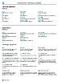

# Unnið með [!INCLUDE[prod_short](includes/prod_short.md)]
Þegar viðskiptaverk eru unnin er vinna með gögn margvísleg: stofna færslur, slá inn gögn, raða og afmarka gögn, skrifa athugasemdir, auk úttöku gagna í önnur forrit.

Til dæmis er hægt að leiðrétta stærð og stöðu hvaða síðu sem er, víkka dálka og hækka dálkfyrirsagnir, og breyta flokkun gagna í dálkum. Ef nota þarf láréttu flettistikuna til að sjá alla dálka á listasíðu eða skjalalínum sést að það er fast lóðrétt svæði til að varna flettingu ákveðinna dálka.

## Ábendingar og góð ráð

> [!TIP]
> Til að fá prentvænt yfirlit yfir mest notuðu aðgerðirnar skaltu velja eftirfarandi mynd og sækja PDF-skjalið.
>
> 

## Tenglar til að fá frekari upplýsingar

Í eftirfarandi töflu eru taldar upp ýmsar almennar aðgerðir auk tengla á efnisatriðin sem lýsa þeim.

> [!NOTE]
> Í viðbót við almennar aðgerðir notandaviðmótsins sem er lýst í þessum hluta, geturðu notað aðrar almennar aðgerðir sem eru viðskiptamiðaðri. Frekari upplýsingar er að finna í [Almenn viðskiptavirkni](ui-across-business-areas.md).

| Til að  | Sjá |
| --- | --- |
|Finndu ákveðna síðu, skýrslu, aðgerð, efnisatriði hjálpar eða viðbót samstarfsaðila. |[Finndu síður og upplýsingar með Viðmótsleit](ui-search.md) |
|Fáðu yfirlit yfir síður fyrir hlutverk þitt og fyrir önnur hlutverk og farðu á síður.|[Að finna síður með hlutverkaleit](ui-role-explorer.md)|
| Afmarka gögn í yfirlitum, skýrslum eða aðgerðum með því að nota sérstök tákn og stafi. |[Röðun, leit og síun í listum](ui-enter-criteria-filters.md) |
|Kynntu þér hinar ýmsu almennu aðgerðir sem hjálpa þér að færa gögn inn fljótt og örugglega.|[Gagnainnfærsla](ui-enter-data.md)|
|Kynntu þér hvernig á að afrita og líma göng með því að nota flýtilykla.|[Algengar spurningar um það að afrita og líma](faq-copy-paste.yml)|
| Skoða eða vinna úr gögnum á tilteknu dagsetningabili. |[Vinna með dagsetningar og tíma í dagatali](ui-enter-date-ranges.md) |
| Sjá hvaða reiti verður að fylla út. |[Greina áskilda reiti](ui-mandatory-fields.md) |
|Skilja hvernig staðsetning tölvunnar hefur áhrif á notendaviðmótið og hjálparsíðuna og hvernig á að breyta tungumálinu.|[Breyta tungumáli og landsstaðli](about-locale-language.md)|
|Kynntu þér hvernig á að hafa samskipti við Excel nánast hvaðan sem er í [!INCLUDE[prod_short](includes/prod_short.md)]|[Skoða og breyta í Excel](across-work-with-excel.md)|
|Hengja við skrár, bæta við tenglum eða skrifa athugasemd á kort og skjöl.|[Stjórna viðhengjum, tenglum og athugasemdum á spjöldum og fylgiskjölum](ui-how-add-link-to-record.md)|
| Breyta grundvallarstillingum eins og fyrirtæki, vinnudagsetningu og Mitt hlutverk. |[Grunnstillingum breytt](ui-change-basic-settings.md) |
|Fáðu tilkynningu um tiltekin tilvik eða breytingar á stöðu, líkt og þegar þú ert að fara að reikningsfæra viðskiptamann sem er með gjaldfallna stöðu.|[Stjórna tilkynningum](ui-smart-notifications.md)|
| Breyta hvaða viðmótseiningar birtast og hvar eftir þörfum.|[Sérstilling verksvæðis](ui-personalization-user.md) |
|Skilgreina, forskoða, prenta eða vista skýrslur og skilgreina og keyra runuvinnslur.|[Unnið með skýrslur, runuvinnslur og XMLports](ui-work-report.md)|
| Stjórna efni og sniði skýrslna og skjala, þ.m.t. hvaða gagnareitir gagnasafns skýrslu birtast í henni, stöðu þeirra, textastíl, myndir og meira.|[Stjórna útliti skýrslna og skjala](ui-manage-report-layouts.md) |
|Fræðast um eiginleika og nothæfni [!INCLUDE[prod_short](includes/prod_short.md)] sem auðveldar aðgengi fatlaðra.|[Aðgengi og Flýtivísanir](ui-accessibility.md)|

## Farið um Business Central
Hér er stutt myndband um hvernig á að komast um í [!INCLUDE[prod_short](includes/prod_short.md)].

> [!VIDEO https://www.youtube.com/embed/zqz03iMihx0]

## Tölvuvafri valinn

[!INCLUDE[prod_short](includes/prod_short.md)] styður marga vafra sem hver um sig býður upp á fjölbreytta eiginleika og getu. Vafrinn gegnir mikilvægu hlutverki í svörun og flæði notandaviðmótsins. Sjá lista yfir studda, ráðlagða vafra fyrir [Business Central Online](https://go.microsoft.com/fwlink/?linkid=2110804) og vafra fyrir [Business Central á staðnum](https://go.microsoft.com/fwlink/?linkid=2110719).

- Ef það er hægt, skal forðast eldri vafra á borð við Internet Explorer og skipta yfir í einn af nýju vöfrunum sem við ráðleggjum, t.d. [nýja Microsoft Edge](https://www.microsoft.com/edge/).  

    Internet Explorer er enn studdur, en fyrst að nýi Edge-vafrinn er nú í boði fyrir Windows Server sjáum við minnkandi notkun á Internet Explorer. Einnig er hægt að fá [tilraunaútgáfu af Edge í IE-stillingu](https://www.microsoft.com/edge/business). Frekari upplýsingar er að finna í [Microsoft Edge fylgiskjöl](https://support.microsoft.com/hub/4337664/microsoft-edge-help).
- Uppfærðu vafrann þinn alltaf í nýjustu útgáfu.

## Sjá tengda þjálfun á [Microsoft Learn](/learn/paths/work-pro-data-dynamics-365-business-central/)

## Sjá einnig

[Hafist handa](product-get-started.md)  
[Uppsetning Business Central](setup.md)  
[Almenn viðskiptavirkni](ui-across-business-areas.md)  
[Ábendingar um frammistöðu fyrir fyrirtækisnotendur](/dynamics365/business-central/dev-itpro/performance/performance-users?toc=/dynamics365/business-central/toc.json)

## [!INCLUDE[prod_short](includes/free_trial_md.md)]

[!INCLUDE[footer-include](includes/footer-banner.md)]